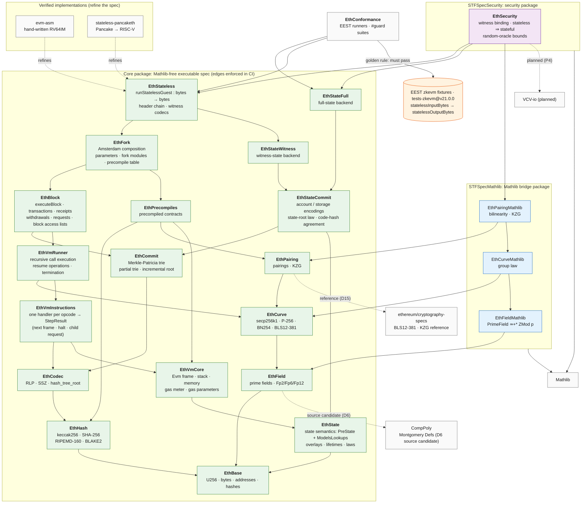

# STFspec

A formal, executable Lean 4 specification of the Ethereum execution-layer state transition function, as run by the zkVM guest program (stateless block validation). It is the specification that [evm-asm](https://github.com/Verified-zkEVM/evm-asm) and [stateless-pancaketh](https://github.com/pirapira/stateless-pancaketh) are to be verified against. It is also meant to be fast enough for differential testing and fuzzing.

It will replace the spec currently in evm-asm (`EvmAsm/Stateless/SpecRef`). It is written from scratch rather than moved, and equivalence with SpecRef is not a goal (decision P6). The consumers retarget in their own repositories; this repository never edits them.

**Status (2026-09-29):** the scaffold supports lower-layer implementation against the informal specs and module gates ([readiness assessment](STFSpec/informal/REVIEW.md#6-implementation-readiness-assessment-2026-09-29)). The interfaces have been prototyped and the reference's failure sites inventoried; classifying the remaining sites (X1), fuel adequacy and witness/full-state agreement are still open (`STFSpec/informal/REVIEW.md` §7). The build, dependency boundaries and declaration checks pass. `EthBase` now implements the U256 value, constructor, unsigned-order, unsigned-arithmetic and comparison/bitwise slices with public laws and regression guards; its remaining API and other core components are scaffolding. The semantic guest conformance runner is absent, and no EEST guest execution is implemented.

**Agents and new contributors: start with [`AGENTS.md`](AGENTS.md)**, which maps each task to the documents to read and update.

**Normative target:** `tests-zkevm@v21.0.0` (execution-specs `e1a316a0`, Amsterdam), pinned in [`reference.toml`](reference.toml). Passing its EEST zkevm fixtures is mandatory and decisive.

## Architecture

Arrows point from a library to the libraries it depends on. The core part of the diagram is **generated from [`scripts/boundaries.toml`](scripts/boundaries.toml)**, the same table that CI enforces, and shows its transitive reduction (a dependency implied by a longer path is omitted). Proof edges come from [`contracts.toml`](STFSpec/informal/contracts.toml), and the fixture label comes from [`reference.toml`](reference.toml).

Key boundaries:
- State semantics (`EthState`) never see the trie. `EthStateCommit` owns state encodings and commitment laws; the two backends implement that seam. Block execution also uses the generic trie for transaction/receipt roots.
- Opcode handlers (`EthVmInstructions`) never see the recursive runner or the precompile implementations.
- Nothing in the core package depends on Mathlib.

Details are in [`STFSpec/informal/ARCHITECTURE.md`](STFSpec/informal/ARCHITECTURE.md). The Mathlib/VCV-io/CompPoly/cryptography-specs nodes are external: CompPoly is the source of vendored field code, not a dependency, and cryptography-specs is a reference only (D6, D15, D26).

<!-- BEGIN GENERATED ARCHITECTURE (scripts/gen_arch_diagram.py) -->

<!-- END GENERATED ARCHITECTURE -->

## Repository layout

| Path | What |
|---|---|
| [`AGENTS.md`](AGENTS.md) | entry point: authority order, hard rules, and a task-to-documents map |
| `lakefile.toml`, `STFSpec/` | the **core package** (Mathlib-free, `require`s nothing): one Lake library per component |
| `STFSpecMathlib/` | the **Mathlib bridge package**: field isomorphisms, group laws, bilinearity (depends on the core; never the reverse) |
| `STFSpecSecurity/` | the **security package**: witness binding, stateless ⇒ stateful, random-oracle bounds (depends on the core and the bridge package; VCV-io enters here only) |
| `scripts/` | compiled declaration checks, regression fixtures, source/document guards and generators |
| [`reference.toml`](reference.toml) | the pinned reference: execution-specs release and commit, fixture archive, locked Python dependencies, Lean version |
| [`STFSpec/informal/`](STFSpec/informal/README.md) | the **informal specification**: one document per library, composition, gates, gaps |
| [`CONTRIBUTING.md`](CONTRIBUTING.md) | the principles and hard rules every contribution follows |

## Building and checking

```sh
lake build --wfail                    # core package
python3 scripts/check_boundaries.py   # dependency and hygiene boundaries (source level)
scripts/check_decls.sh core                 # compiled declarations: axioms, sorry, partial/opaque, extern, csimp
lake build CheckDeclsTest check-decls && scripts/test_checks.sh   # the checkers catch what they should
python3 scripts/test_reference_checks.py # pin, archive and diagram regressions
python3 scripts/check_reference.py     # pin consistency (add --fetch DIR to verify the fixture archive)
python3 scripts/gen_arch_diagram.py --check   # README diagram matches registries and pin
python3 scripts/check_spec.py         # module-spec structure, EELS coverage, ownership, decision IDs
python3 scripts/test_spec_checks.py   # the spec checker's own regression tests
python3 scripts/gen_gaps.py --check   # STFSpec/informal/GAPS.md is regenerated from the spec guidance documents
lake build EthConformance --wfail

(cd STFSpecMathlib && lake exe cache get && lake build --wfail) && scripts/check_decls.sh mathlib
(cd STFSpecSecurity && lake build --wfail) && scripts/check_decls.sh security   # shares the Mathlib checkout
```

Regenerate the fixture area index with `python3 scripts/gen_fixture_index.py <ARCHIVE>` from the authenticated archive; add `--check` to verify freshness.

Regenerators that need a pinned EELS checkout (not run in CI): `python3 scripts/gen_eels_inventory.py <EELS> --check` and `python3 scripts/gen_reference_records.py <EELS> --check`.

The workflow ([`.github/workflows/ci.yml`](.github/workflows/ci.yml)) runs these checks on pushes to `main` and on pull requests. Weekly and manual runs download the pinned fixture archive and verify its checksum and record counts. That verifies corpus integrity only; fixture execution arrives with the conformance runner.

## Documents

Navigation by task is in [`AGENTS.md`](AGENTS.md). The main documents:

- [`STFSpec/informal/README.md`](STFSpec/informal/README.md): **the informal specification**: module index, end-to-end sequence diagram, seams, cross-module invariants. Spec guidance documents are in [`STFSpec/informal/modules/`](STFSpec/informal/modules); the generated gap register is [`STFSpec/informal/GAPS.md`](STFSpec/informal/GAPS.md).
- [`STFSpec/informal/CONTRACT.md`](STFSpec/informal/CONTRACT.md): input/output encoding, the outcome table O1–O13, the authority and discrepancy policy, the security scope. The pin itself is [`reference.toml`](reference.toml).
- [`STFSpec/informal/DECISIONS.md`](STFSpec/informal/DECISIONS.md): every design decision and question disposition, with its status and the evidence needed to revisit it.
- [`CONTRIBUTING.md`](CONTRIBUTING.md): the principles (golden rule, legibility, performance, hygiene, review), the pull-request workflow, and the Lean style and documentation conventions.
- [`STFSpec/informal/ARCHITECTURE.md`](STFSpec/informal/ARCHITECTURE.md): libraries, allowed dependencies, component contracts, data structures, state lifetimes, fork structure, change management, decision options.
- [`STFSpec/informal/REVIEW.md` §7](STFSpec/informal/REVIEW.md#7-acceptance-criteria-proof-gates-composition-cases-replacement-and-cost-checks): proof gates, composition cases, replacement gates and cost checks an implementation must meet.

## Licence

Licensed under either of [Apache License, Version 2.0](LICENSE-APACHE) or [MIT licence](LICENSE-MIT), at your option. Unless you explicitly state otherwise, any contribution intentionally submitted for inclusion in this work shall be dual licensed as above, without any additional terms or conditions.

Vendored third-party code keeps its own licence.
