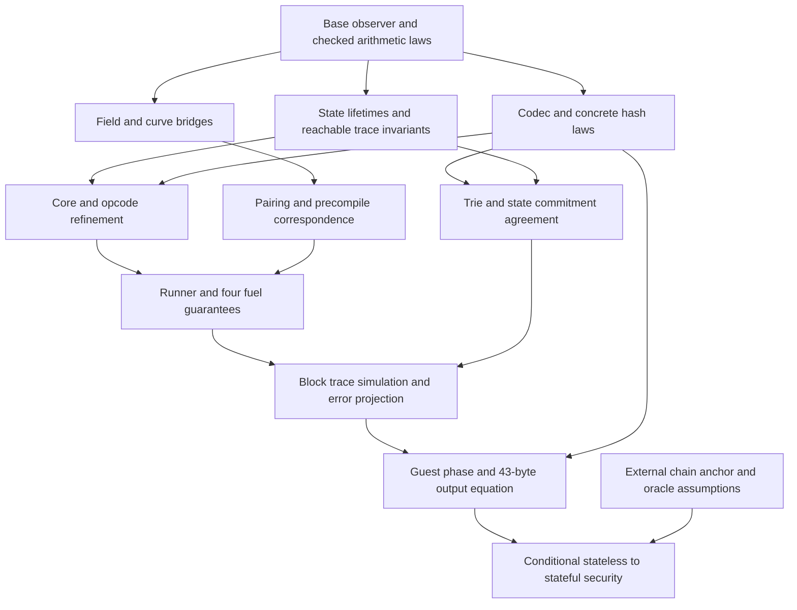

# Conditional correctness of the complete guest

*Status: conditional proof plan. Date: 2026-09-30.*

Reviewed against `tests-zkevm@v21.0.0`, commit `e1a316a06fc3d3e0a5da36fdc78580811e9d8a36`, on 2026-09-28. This is the shared contract for the spec guidance documents. It states a proof plan and its unproved premises; it does **not** certify that the current draft, or a future implementation merely following it, is already complete or sound. [REVIEW](REVIEW.md) records the remaining gates.

## 1. Three distinct correctness statements

1. **Reference fidelity:** the guest produces the same bytes as the pinned Python guest on an agreed domain and reference environment, including validation failures. Host resource/capability differences require the unresolved D14/O12 policy; they cannot be silently classified as irrelevant.
2. **Semantic soundness:** a successful stateless execution agrees with a well-formed, code-authentic full state having the supplied parent root, or supplies a hash collision. This is conditional on data availability, the precise oracle model, and the relevant component refinements.
3. **Accepted-chain security:** that full state and its header context belong to the verifier's accepted chain. Chain ID, activation, parent anchoring and zkVM/compiled-guest correctness are external obligations. A guest success alone does not establish them.

Termination, reference fidelity and hash-based soundness are separate. Mathematical termination must hold without assuming collision resistance. Fixtures provide evidence for fidelity, not universal proofs of these statements.

## 2. Type ownership and adapters

The checked registry is [contracts.toml](contracts.toml). A consumer imports the owner's declaration through an allowed dependency; it must not redeclare a lookalike. Source ownership and type ownership differ: EthBlock claims Python `Log`, while EthVmCore owns Lean `Log` under D27 (accepted 2026-09-28). The interfaces below are Lean-like contracts. A compiled prototype of these interfaces covered one complete path through them, and its dispositions are in `STFSpec/informal/DECISIONS.md` §3.

| Contract | Owner | Required consumer behaviour |
|---|---|---|
| HashConsts | EthBase | Acquisition/threading follows F20; existing state/backend contexts retain the same record. |
| Account, MathState, `PreState m`, BlockDiff | EthState | Callers use observers and ordered writes; they never inspect backend trie representation. |
| Models, CodeAuthentic, CodeChangesAuthentic | EthStateCommit | Structural WF, answer/root agreement and code authenticity are separate premises. Progress/availability is additional. |
| VmWorld, VmConfig, Log, LogRope | EthVmCore | VmWorld contains one TxState. TxObs and the ancestor cursor have one authoritative location. LogRope flattening defines visible order. |
| PrecompileResult, `PrecompileFn m`, `PrecompileTable m` | EthVmCore | EthPrecompiles creates implementations; EthFork installs pricing closures; EthVmRunner uses the same types and returned meter. |
| StepResult and requests/resume | EthVmInstructions | Handlers suspend, runner executes a child, resume observes a settled child. No handler imports the runner. |
| InternalError, CheckedResult, `CheckedT` | EthVmRunner | Every caller propagates the internal channel without treating it as a validation error. |
| BlockConfig, BlockOutput, transaction/header records and errors | EthBlock | EthFork supplies values; EthStateless supplies payload/header adapters. BlockOutput is not defined in VmCore. |
| StatelessInput and StatelessValidationResult | EthStateless | EthConformance uses the same schemas; expected bytes are independent of a containing fixture's block-validity label. |

### SHA-256 digest premise

[EthHash §3](modules/EthHash.md#3-eels-source-map) supplies the pure total
`sha256 : ByteArray → Bytes32` API and its padding, byte-order, ordered chaining
and full-digest model laws. Standard-domain correspondence retains Q46's caller
hypothesis. This supplies the digest operation for future SSZ/request consumers;
record encoding, request-root composition and collision assumptions remain their
owners' obligations.

### RIPEMD-160 digest premise

[EthHash §3](modules/EthHash.md#3-eels-source-map) supplies the total pure
`ripemd160 : ByteArray → FixedBytes 20` provider and all-input MD4 padding,
little-endian word/byte and ascending chaining laws into an inductive digest
model. Base packed generation, byte-list observations and checked fixed-byte
construction, together with the accepted compression bridge, supply its premises.
The future precompile consumer still owns gas-before-computation, the twelve-byte
zero prefix and host capability/resource policy (DISC-005/O12). Finite actual
pinned precompile observations do not discharge those Lean composition obligations.

### BLAKE2F parameter premise

`EthPrecompiles` establishes `data.size = 213` after its size check before calling
`Blake2b.getParameters`. The raw codec preserves every round count and flag;
its public byte laws and two inverse laws are owned by
[EthHash §3](modules/EthHash.md#3-eels-source-map). The precompile then owns gas
charging and flag rejection in R5 order before invoking compression.

BLAKE2b F's pure compression/byte premise is discharged for all UInt32 counts by
[EthHash §3](modules/EthHash.md#3-eels-source-map). Its precompile consumer must still
establish gas-before-compression and validate the raw flag after charging gas;
those effect/order obligations are not produced by the pure hash function.

### Keccak digest premise

The concrete fixed-rate Keccak provider supplies total byte-level model
correspondence and fixed widths ([EthHash §3](modules/EthHash.md#3-eels-source-map)).
Query dispatch, acquisition and oracle coupling have separate premises below.

The separate packed candidate supplies ordinary all-input equality with these
retained reference endpoints, including padding, block absorption and byte output
([EthHash §3](modules/EthHash.md#3-eels-source-map)); current defaults remain unchanged.
These laws do not supply the query instance, acquisition or oracle coupling, and
local native diagnostics do not supply target/resource composition.

### Hash constants and oracle premises

Constants acquisition and coherence follow F20 (EthStateless R5, EthBlock §2.7,
EthConformance R4); a `consts` parameter alone does not establish coherence, and
generic interpretation coupling remains open (D5, X7).
The query interface additionally supplies definitionally concrete Id dispatch,
forwarding ExceptT/StateT instances and ordered four-query `HashConsts.query`
acquisition, with public run equations and arbitrary-answer/error observations
(EthHash §3). Concrete equality to Base literals is evaluated through guards and
authenticated pinned globals; it is not an equality theorem. Production F20 entry
seams, consumer coherence and generic oracle coupling remain open.

### Checked error channels

`CheckedResult ε α := Except InternalError (Except ε α)` has exactly three interpretations:

- `.ok (.ok a)`: successful computation;
- `.ok (.error e)`: a validation/backend fault, projected according to its guest phase;
- `.error i`: spec-internal failure, retained by the checked guest.

Every hashing interface is parametric in `{m} [Monad m] [KeccakQuery m]`, and execution specialises to `m := Id` (D5). The monadic form is `CheckedT ε m := ExceptT ε (ExceptT InternalError m)`, whose `.run.run` gives `m (CheckedResult ε α)`. The adapter `runVmChecked : VmM m (Except InternalError α) → VmWorld m → m (CheckedResult VmFault (α × VmWorld m))` converts without swapping meanings. For an action run on world `w`:

```text
action w = .error vf                    => .ok (.error vf)
action w = .ok (.error i, w')           => .error i
action w = .ok (.ok a, w')              => .ok (.ok (a, w'))
```

`BlockError.ofStateError` maps witness faults to `.witness` and other state faults to `.state`. `BlockError.ofVmFault` delegates `.state e` to that adapter and maps other VM faults to `.vmFault`. Transaction decode errors are indexed at the block/payload caller. On the complete guest path they cannot reach `executeBlock`: `is_valid_versioned_hashes` consumes every deterministic decode failure first, giving O6. They stay live for a standalone `executeBlock`. Public-key count and wrong-key errors remain distinct, with the transaction index retained for the latter. EVM exceptional halt/revert are FrameError data inside a completed run; they use settlement, not these global-error adapters. An unchecked system call ignores a settled FrameError, not a provider fault or InternalError.

Guest classification preserves the outer/inner Python handler boundary: decode/schema failure gives O1; root computation failure gives O2 (to be proved unreachable on decoded values: DECISIONS §3, O2); after a root exists, inner validation faults, including the enumerated O13 faults, produce `(root,false,chainId,0x1501)`. An InternalError remains checked; only the public total projection uses the documented sentinel fallback. Proving that fallback unreachable requires the fuel theorem **and** a proof that arbitrary accepted input constructs valid contexts. X1 still needs an exhaustive classification of the reachable exception sites before this projection is complete.

### Configuration and crypto adapters

Construct `vmConfig := {costs, stateCosts, limits}` once. FrameCtx and RunnerEnv receive that same config; child contexts inherit it. `BlockConfig.runnerEnv` derives it from `gas`, `stateGas`, `limits` and `precompiles`. Each precompile closure captures its pricing from that config. Successful `PrecompileResult.ok m' out` satisfies:

```text
m'.gasLeft ≤ m.gasLeft
{m' with gasLeft := m.gasLeft} = m
```

Install `m'` directly, with no second charge. The table's address set equals its lookup domain and supplies transaction warm addresses. Amsterdam's depth remains 0 through 1024 inclusive; making other limit fields configurable does not establish support for arbitrary depth policies.

secp256k1 recovery returns Bytes64, the unprefixed x/y bytes. Hash those bytes for an address; a 65-byte public-key hint includes prefix 0x04 and must be checked against recovery/signature semantics. Boolean parity recovery completeness is restricted to the documented `x=r<n` domain. `mapToCurveG1/G2` stop before cofactor clearing; EVM mapping wrappers clear exactly once. These are semantic adapters, not representational conveniences.

For payload conversion, `Array PublicKey` erases each subtype to its ByteArray for EthBlock while retaining the 65-byte/prefix/verification checks. `AnyHeader` is the existing ParentHeader sum, not a second header representation. [REFERENCE-RECORDS](REFERENCE-RECORDS.md) fixes source field order, widths and inheritance for all wire/schema adapters. Dense transaction/receipt/withdrawal arrays in BlockOutput model index-keyed unsecured tries: root construction uses `rlp i` keys and the reference typed/legacy value encoding; receipt traversal for requests follows recorded receipt_keys, appended in transaction order, rather than sorting RLP keys (fork.py:1124; requests.py:291).

## 3. Inductive state invariant

Let `Reachable` mean a trace starting from valid block/transaction construction and using the specified admission, step, call, settlement, BAL and incorporation operations. This trace predicate must be defined; it is stronger than arbitrary calls to public raw helpers.

The induction invariant has the following parts:

1. Structural MathState/overlay invariants, including no orphan storage and the specified absent-account defaults.
2. Every changed account has been looked up in the immutable provider context before its first write. This populates the reference witness storage-root cache. The pure witness provider repeats the same immutable lookup at root computation rather than storing call history; the reachable trace proves that extra lookup succeeds and agrees. A raw setAccount/destroyAccount does not establish this fact.
3. TxRevertible contains writes, clears, transient values and write-order metadata; TxObs stays outside snapshots. Rollback selects the saved revertible roots and retains observations/created-account tracking and the authoritative ancestor cursor.
4. Account order, storage-address order and per-address slot order enumerate each current live write once. A clear resets the affected storage ordering, makes pending writes into reads, and hides lower overlays. Incorporation performs clears before ordered writes.
5. BAL updates observe the unmerged transaction and block views, then merge. First-index pre-values, nonce maximum and balance/code last-value behaviour follow the source builder.
6. Code hashes newly installed by callers authenticate their bytes. This is CodeChangesAuthentic, not a structural law of EthState, which cannot import hashing.

The empty construction establishes the invariant. Each operation's observer equation preserves it; the caller establishes the operation's preconditions. Snapshot/restore proves part 3 directly. Ordered fold induction proves parts 1 and 4 at incorporation and diff extraction. Parts 2 and 6 require proofs across Block, Instructions and Runner, rather than an assertion in State alone. WriteOrder uses persistent position indexes so erase/reinsert and snapshots do not rely on repeatedly filtering a list.

Witness updates must use the recorded order. EELS's branch collapse can need unavailable siblings, so exchanging delete and insert can exchange failure with success. Even a successful no-op delete can change an accepted noncanonical node's root. Canonical finite-map root laws therefore cannot be applied unconditionally to raw witnesses. The storage-root-only rewrite phase's set-order independence remains an explicit obligation.

## 4. Composing VM execution and termination

The dependency order is Core → Instructions → Runner; precompile implementations reach Runner through the table, and the runner alone executes children. For each opcode, the local proof matches the ordered Python guards, effects and failure priority. The request boundary captures everything needed to resume; the child theorem supplies its settled meter, output, logs, state and error. FrameResult.toChildOutcome copies those fields with its non-top ChildSettled proof; runFrame alone is not a settled child result. How the runner produces that proof is open (DECISIONS F11): either a decidable check raising `InternalError.invariant`, proved dead together with the fuel guarantees, or a settled subtype returned by the runner. Resume equations complete the corresponding Python call/create operation.

Define Exec from these same step/resume/settlement operations. Induction on checked execution proves soundness. Induction on a finite Exec derivation chooses sufficient fuel and proves completeness; the same derivation proves monotonicity for larger fuel **with semantic gas fixed**. Gas-dependent code makes a general gas-monotonicity claim false.

For computable sufficiency use Φ = gasLeft + stateGasSpilled + stateGasCommittedSpill. Local meter algebra establishes neutral redistribution and decreases for execution charges. Strengthen runner induction with child-final Φ ≤ child-entry Φ. The whole parent iteration, including forwarding, EIP-150, stipend, failed preflight, child settlement and returned gas, must decrease Φ whenever execution continues. Then entry Φ continuing iterations plus one terminal iteration gives `phiBudget`. This is the candidate proof, not a proved bound. Numeric schedule checks do not establish the whole-round-trip inequality.

Structural totality separately uses remaining depth, helper stage and fuel. The checked result of every child/top-level call retains InternalError. Only after proving the four guarantees and context invariants may the guest theorem conclude O11 is unreachable. Host recursion depth, memory allocation and zkVM cycles require measurement of the compiled implementation; mathematical fuel sufficiency does not discharge those operational obligations.

## 5. Backend-parametric block simulation

`Models` relates successful answers/roots to σ and includes structural WF and CodeAuthentic. It does not promise those operations succeed: an always-error provider otherwise satisfies implications vacuously. The full side needs progress on the execution trace, including CodeComplete. The witness side may fail on unavailable nodes or code.

Witness agreement also requires authenticated witness node/code databases, coherent oracle-derived constants and the specified decode thunk (EthStateWitness.WitnessBackend.WF). Guest construction must establish those premises.

For a **successful witness trace**, compare it with a progressive full provider representing σ. At each query, successful-answer agreement gives the same value, or the collision extractor reports unequal preimages with equal hash. Deterministic step/validation laws then choose the same branch and preserve the observation/state invariant. Induct through child frames, transaction settlement and block incorporation. The ordered final diff is the same; the backend root law gives the mathematical post-state root or a collision. This is directional simulation of successful witness execution, not equality of success/failure for any pair of Models providers.

The extractor must cover node encodings, address/slot preimages, dirty updated paths and code preimages from both providers. Structural WF alone does not authenticate σ.code; a state root binds code hashes, not bytes in a separate store. The secure-key collision case also needs a specified fold order for full roots.

This simulation establishes the conditional block-level theorem once all induction cases are proved. It does not establish that every honest witness succeeds. Witness completeness requires a separate construction/availability theorem, including eager off-path decoding obligations.

## 6. Composing bytes, validation and commitments

Codec type induction plus per-record instance inverses turns accepted bytes into the same guest value as the reference. Rootability/offset domains must be shown for actual accepted inputs; do not add a new bound merely to make the proof work. Compute the request commitment before inner validation, as in Python. Header decoding and contiguity checks then construct the context. Payload guards, block admission and execution follow their ordered contracts. Section 5 supplies semantic agreement on successful execution, and the complete error projection supplies reference failure outputs.

Final encoding is fixed: 32-byte request root, boolean byte, eight-byte little-endian chain ID, two-byte little-endian schema ID, in that order (CONTRACT §3); the input prefix's schema ID is big-endian. The zero sentinel sets every field to zero. Case analysis over the phases proves the 43-byte output equation, conditional on domain/host agreement and the completed X1 classification.

Header-chain binding additionally needs an external accepted tip. Request binding uses the exact guest schema and a separate SHA-256 collision statement. Keccak trie/code/header binding must use one resolved oracle scope: arbitrary-oracle hashes cannot be combined silently with literal concrete empty roots/code hashes or concretely produced new code hashes. D5 resolves this: the constants are `HashConsts`, queried through the same oracle. The ROM experiment must count adversary, guest, full-state and extractor queries. The coupling of `Models` at generic `m` remains open (X7). F20 specifies the acquisition/threading design; production composition must still establish coherent constants across the witness, payload checks and block, including their availability before block-header validation.

## 7. Proof dependency diagram and discharge table



This is a proof dependency graph, not the core import graph; in particular State does not import commitments. All nodes are obligations until their module laws and arguments are discharged.

| Premise | Producer | Consumer | Current discharge |
|---|---|---|---|
| Integer/byte/model equations | Base | all layers | partial discharge: implemented primitive model laws in [EthBase §3](modules/EthBase.md#3-eels-source-map); remaining premises in EthBase §10 |
| Canonical codecs and actual schema domains | Codec + record owners | Guest, Commit, Block | schemas/layout catalogued; inverses/domain proof open |
| Valid curve/pairing and exact adapters | Field/Curve/Pairing + bridges | Precompiles/Runner/Block | conditional arguments; concrete proofs open |
| Reachability, ordered diff and rollback | State + Block/Instructions/Runner | Witness/BAL/block simulation | API revised; caller induction open |
| Canonical vs accepted witness agreement | Commit/StateCommit/Witness | Security | counterexamples reproduced; extractors/commutation open |
| Whole-iteration progress and context WF | Core/Instructions/Runner/Fork | checked guest | candidate bound; fuel-adequacy investigation required ([REVIEW §7](REVIEW.md#7-acceptance-criteria-proof-gates-composition-cases-replacement-and-cost-checks) G2–G7) |
| Exact outcome projection | each semantic owner; Conformance coordinates X1 | Stateless | shared channels aligned; exhaustive site classification open |
| Backend progress/authenticity | Full + fixture/pre-state construction | block simulation | premises explicit; implementation/proof open |
| Anchors and oracle coupling | consumer + Security | security conclusion | external anchor specified; D5 coupling open |

An implementation is ready for a claimed end-to-end theorem only when every required premise has a producer and a discharged proof. Markdown argument sections and mechanical document checks are necessary scaffolding; they cannot guarantee the truth of an unproved premise.
