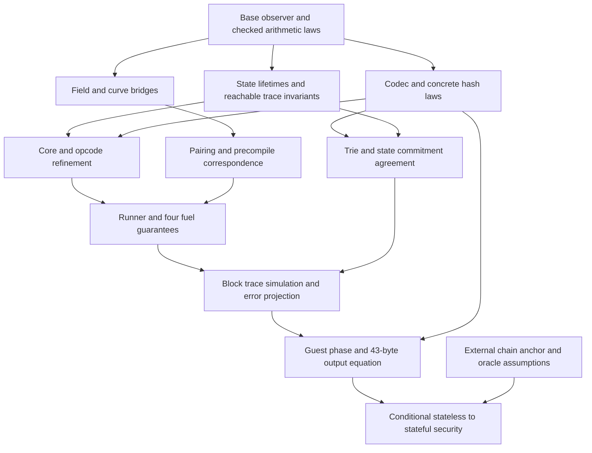

# Conditional correctness of the complete guest

*Status: conditional proof plan. Date: 2026-10-06.*

Reviewed against `tests-zkevm@v21.0.0`, commit `e1a316a06fc3d3e0a5da36fdc78580811e9d8a36`, on 2026-09-28. This is the shared contract for the spec guidance documents. It states a proof plan and its unproved premises; it does **not** certify that the current draft, or a future implementation merely following it, is already complete or sound. [REVIEW](REVIEW.md) records the remaining gates.

## 1. Three distinct correctness statements

1. **Reference fidelity:** the guest produces the same bytes as the pinned Python guest on an agreed domain and reference environment, including validation failures. Host resource/capability differences require the unresolved D14/O12 policy; they cannot be silently classified as irrelevant.
2. **Semantic soundness:** a successful stateless execution agrees with a well-formed, code-authentic full state having the supplied parent root, or supplies a hash collision. This is conditional on data availability, the precise oracle model, and the relevant component refinements.
3. **Accepted-chain security:** that full state and its header context belong to the verifier's accepted chain. Chain ID, activation, parent anchoring and zkVM/compiled-guest correctness are external obligations. A guest success alone does not establish them.

Termination, reference fidelity and hash-based soundness are separate. Mathematical termination must hold without assuming collision resistance. Fixtures provide evidence for fidelity, not universal proofs of these statements.

## 2. Type ownership and adapters

The checked registry is [contracts.toml](contracts.toml). A consumer imports the owner's declaration through an allowed dependency; it must not redeclare a lookalike. Source ownership and type ownership differ: EthBlock claims Python `Log`, while EthVmCore owns Lean `Log` under D27 (accepted 2026-09-28). The interfaces below are Lean-like contracts. A compiled prototype of these interfaces covered one complete path through them, and its dispositions are in `STFSpec/informal/DECISIONS.md` §3.

| Contract | Owner | Required consumer behaviour |
|---|---|---|
| HashConsts | EthBase | Acquisition/threading follows F20; existing state/backend contexts retain the same record. |
| Nibbles | EthCommit | Consumers use public bounded digits, List abstraction, pure path laws and Q49 generation/clipped copies/lawful lexical map order; slices copy O(k). |
| Enc, Node, Ref | EthCommit | Preserve complete fields and recursive Array/Option children (EthCommit §3); semantic adoption remains conditional on B3/NEW-COMMIT-1/DISC-003, with remaining gates owned by EthCommit §10. |
| IncrementalMPT | EthCommit | Retain the complete supplied Bool and Ref; the Q55 complete decoder action is supplied separately (EthCommit §3/§5). Mutation/root and representation/admission obligations remain owned by §10 (B3). |
| InternalNode | EthCommit | Supply already interpreted byte/list fields and sixteen ordered children; use public assembly/model/query laws. |
| Trie, TrieValue, KeyBytes | EthCommit | Q53 supplies generic storage/safety, the byte-key contract, pure unsecured preparation and typed root composition; remaining concrete consumer contracts require lawful arbitrary-default equality, stored-value `PrepareSafe` distinct from `NoDefault`, injective byte keys with byte-lex order and caller-supplied coherent F20 empty root; initial preparation/root calls prove unsecured. |
| TrieError, Malformed | EthCommit | Keep Q52 path-list/leaf-value-list diagnostics in C14 order, raw compactEmpty distinct from later pathEmpty. Q59 supplies a bare selected-slot diagnostic and pure lookup equations; witness/guest adapters and reachable outcome projection remain separate, owned by CONTRACT O4/O13. |
| NodeDB, `NodeDB.Authentic` | EthCommit | Share the constructed raw table read-only. Concrete root-binding/agreement consumers require `Authentic keccak256`; Q55 decoder admission accepts arbitrary tables and caches actual occurrence answers. A generic oracle table alone supplies no concrete authenticity; equality of a decoded cache to a reference also needs eligible raw length. |
| Account, MathState, `PreState m`, BlockDiff | EthState | EthState §3/§7 owns supplied Account, raw MathState, raw BlockDiff, raw mathematical apply, raw PreState carrier and supplied-record ModelsLookups contracts. The carrier retains complete supplied functions without a Monad premise; equality adds no action-effect interpretation. Coarse WitnessItem/WitnessError and nominal StateError values retain supplied tags/payloads through construction/elimination; they add no diagnostic or outcome adapter. StateError operations and freezing remain open (EthState §5/R29/§10). Actual providers and context coherence, progress, code/root agreement and error refinement remain open. Raw diff callers preserve whole optional payloads and every metadata occurrence. Apply uses all four effect fields and ignores order metadata; it preserves untouched raw entries and requires no WF. Concrete source correspondence requires typed finite nonaliasing account/storage dictionaries with defaults None/zero and coherent F20 constants for code observations. Diff WF, reachable preservation, first-write history and F7 replay policy remain separate obligations. Callers use observers and ordered writes; they never inspect backend trie representation. |
| Models, CodeAuthentic, CodeChangesAuthentic | EthStateCommit | Structural WF, answer/root agreement and code authenticity are separate premises. Progress/availability is additional. |
| VmWorld, VmConfig, Log, LogRope | EthVmCore | VmWorld contains one TxState. TxObs and the ancestor cursor have one authoritative location. LogRope flattening defines visible order. |
| PrecompileResult, `PrecompileFn m`, `PrecompileTable m` | EthVmCore | EthPrecompiles creates implementations; EthFork installs pricing closures; EthVmRunner uses the same types and returned meter. |
| StepResult and requests/resume | EthVmInstructions | Handlers suspend, runner executes a child, resume observes a settled child. No handler imports the runner. |
| InternalError, CheckedResult, `CheckedT` | EthVmRunner | Every caller propagates the internal channel without treating it as a validation error. |
| BlockConfig, BlockOutput, transaction/header records and errors | EthBlock | EthFork supplies values; EthStateless supplies payload/header adapters. BlockOutput is not defined in VmCore. |
| StatelessInput and StatelessValidationResult | EthStateless | EthConformance uses the same schemas; expected bytes are independent of a containing fixture's block-validity label. |

### Internal first-write order premise

[EthState §3/§7.5](modules/EthState.md#3-eels-source-map) supplies the raw
persistent `WriteOrder` support; its component laws are owned by EthState §7.5. WF is
exact inverse/bound consistency; Agrees separately equates optional forward
presence with an arbitrary associated write map, including tombstones and zero.
Lawful key equality and both predicates enable later coupled ordered folds.
Full clear/restore/incorporation/extraction, caller reachability and account-read
history remain open, together with S1/S2 and composed C1/C4. Paired-root finite
tests do not establish the whole State invariant or select F7 clear traversal.

### Raw mathematical-state premise

[EthState §3/§7](modules/EthState.md#3-eels-source-map) supplies the Account value
provider and raw three-map MathState with total `account?`, `storageAt` and
`code? σ consts h`. Missing address/slot storage defaults to zero; optional account
absence differs from a present empty account. The caller's empty-code hash bypasses
raw code lookup; missing nonreserved model code remains `none`. Provider missing-code
errors (B2) remain unchanged. Source correspondence requires coherent F20 constants;
the model itself accepts arbitrary records and raw maps.

The [raw and structural laws](modules/EthState.md#raw-mathematical-state-observer-laws)
retain raw field/lookup extensionality and exactly three `WF` clauses: nonzero slots, nonempty inner maps and storage-domain
inclusion in accounts. Raw lookup extensionality keeps whole optional inner maps
and all raw code hashes. Fixed-constants observer equality cannot determine raw
code, even under `WF`; code authenticity/completeness are separate premises.
`wf_empty` proves only the empty raw triple's structural invariant. Raw mathematical
application is supplied by EthState §3/§7; mutation, providers, reachability,
diff/order/overlay preservation, S1/S2, commitments
and consumer/resource gates remain open. Complete finite native/reference-list
observations and retained sibling checks establish no composed cost bound.

### Supplied lookup context and bounded structural preservation (Q57–Q58)

[EthState R8/§3/§5](modules/EthState.md#3-eels-source-map) supplies
`ModelsLookups consts ps σ₀` as success-only agreement. Each tracker proof uses the fixed initial
BlockState record/provider carried by the participating contexts. Full binary
Models supplies lookup agreement at EthStateCommit's concrete `constsId`; using
it at the execution record requires F20 coherence. Arbitrary supplied-record lookup
agreement supplies no authentication, availability or root agreement; D5/X7 generic
coupling remains open.

[EthState §7.4](modules/EthState.md#74-invariants-exported-to-other-libraries) owns
Q58's supplied StructuralPremises and ordinary laws. Initial
MathState.WF plus deletion-to-clear and raw storage-change address-to-post-account
presence suffices for structural apply preservation, including empty patches and zero
writes with arbitrary metadata/code/account fields. This local implication supplies
neither full optional-map WF policy nor replay history, reachable extraction,
AccountWritesLookedUp or F7; those obligations remain with their existing producers.

### Typed-trie storage, preparation and root premise (Q53)

[EthCommit §3/§7.0.3](modules/EthCommit.md#3-eels-source-map) supplies generic
arbitrary-default storage and separate `NoDefault`/`PrepareSafe` laws. Its
`TrieValue` class specifies total encoding with nonemptiness under validity;
the generic lawful injective byte-key contract and pure preparation are supplied in
EthCommit §3. Typed root composition and the conditional existing-Bytes key adapter
below are supplied;
concrete consumer encoding and Python key/equality/alias bridges remain unimplemented.
Empty construction supplies both predicates for any
default; an all-value setter preserves safety from a safe input exactly when it deletes
by equality with that default or inserts a valid value. Preparation/root require safety
and `secured = false`, but no `NoDefault`; valid stored defaults are encoded directly.
Implemented preparation is pure with zero queries; the supplied typed root
calls C8 directly on that pure map
with the caller's existing F20 empty root. Local composition/empty equations need only
`Monad`; equality to a separate preparation-bind reference needs `LawfulMonad`.

EthBlock must supply valid concrete legacy records, nonempty typed envelope Bytes and
already-RLP withdrawal Bytes, with lawful byte keys and default `None` semantics. Its
dense arrays use the same EthCommit root operations (§5 of EthBlock), encoding each value once.
EthStateCommit supplies the total U256 encoder, all-value validity/nonempty laws and
wire injectivity (EthStateCommit §3), independently of supplied-default deletion.
It also supplies contextual Account encoding, unconditional nonempty and pair binding
under both complete assembled Q47 domains (EthStateCommit §3). The callback/root
integration remains open; no context-free Account instance follows from this class.
Source bridges additionally supply Python equality/dispatch agreement, valid
supported non-`None` values, complete schema/assembled-node `Encodable` (Q47), coherent
F20 constants and pinned host compatibility. Total invalid encodings imply no Python
success. Secure traversal, collisions, source history and generic coupling remain open;
approval alone supplies no concrete source bridge or consumer/root proof.

### Local account-leaf decoding seam

[EthStateCommit §3](modules/EthStateCommit.md#3-eels-source-map) supplies SC5
with caller-supplied F20 defaults: complete strict RLP, exact four-field shape,
then nonce → balance → root → code. The public contracts characterize all
accepted values and the sole coarse malformed-leaf rejection, raw empty input,
relevant-constants congruence and account SC10. The roundtrip takes **complete
assembled** `Rlp.Encodable`, exactly as account binding does under Q47; callers
must establish child and joined encoded-payload bounds. The private
`AccountDecodeCallerProofs.empty_domain` and `empty_account_roundtrip` clients
discharge and consume this premise for every supplied emptyAccount and Hash32 root.
Explicit 32-byte hashes, including all-zero, are never replaced by defaults.
The private bounded balance fold equals its unsigned checked reference on every
finite input; nonce stays
unbounded. This local seam supplies no triggered backend lookup/root behavior,
secure traversal/callbacks, witness authentication, progress, collision/source-history,
generic coupling, global error adapter/O12, resources, C1–C4 or guest readiness.

### Local storage-leaf decoding seam

[EthStateCommit §3](modules/EthStateCommit.md#3-eels-source-map) supplies the pure
SC6 decoder and nonzero storage SC10 through public RLP/Base contracts.
Complete strict RLP parsing precedes list-to-zero or complete unsigned bytes;
private packed checked folding equals its full Nat reference on every finite Bytes.
The nominal witness-error carrier is owned by
[EthState §3/§5](modules/EthState.md#3-eels-source-map).
Only invalid RLP and parsed numeric overflow map locally to `.malformed .leaf`.
This supplies no global O4 adapter, granularity refinement,
authentication, lookup/progress, secure root/callback, Q55 action or generic
oracle coupling; those remain their owners' obligations. Local Q47 encodability
for SC10 follows the public U256 width bound; no stored-zero policy follows.

### Conditional existing Bytes key provider (Q54)

When a concrete Q53 consumer chooses existing Base `Bytes`,
[EthCommit §3/§7.0.3](modules/EthCommit.md#pure-unsecured-typed-preparation-q53)
owns the adapter and named exact-export law, relying on EthBase's Q54 provider.
RLP ordinal bytes retain byte order (zero `[128]` follows one `[1]`); EthBlock retains
concrete encoder, source equality/schema, safety and coherent F20 empty-root premises.
Public-import preparation/root clients retain those premises; the sequential reference
additionally requires `LawfulMonad`. Concrete consumer costs, host compatibility,
secured policy and generic coupling remain open with their existing owners.

### SHA-256 digest premise

[EthHash §3](modules/EthHash.md#3-eels-source-map) supplies the pure total
`sha256 : ByteArray → Bytes32` API and its padding, byte-order, ordered chaining
and full-digest model laws. Standard-domain correspondence retains Q46's caller
hypothesis. This supplies the digest operation for future SSZ/request consumers;
record encoding, request-root composition and collision assumptions remain their
owners' obligations.

### RIPEMD-160 digest premise

[EthHash §3](modules/EthHash.md#3-eels-source-map) supplies the total pure
`ripemd160 : ByteArray → FixedBytes 20` provider and all-input MD4 padding,
little-endian word/byte and ascending chaining laws into an inductive digest
model. Base packed generation, byte-list observations and checked fixed-byte
construction, together with the accepted compression bridge, supply its premises.
The future precompile consumer still owns gas-before-computation, the twelve-byte
zero prefix and host capability/resource policy (DISC-005/O12). Finite actual
pinned precompile observations do not discharge those Lean composition obligations.

### BLAKE2F parameter premise

`EthPrecompiles` establishes `data.size = 213` after its size check before calling
`Blake2b.getParameters`. The raw codec preserves every round count and flag;
its public byte laws and two inverse laws are owned by
[EthHash §3](modules/EthHash.md#3-eels-source-map). The precompile then owns gas
charging and flag rejection in R5 order before invoking compression.

BLAKE2b F's pure compression/byte premise is discharged for all UInt32 counts by
[EthHash §3](modules/EthHash.md#3-eels-source-map). Its precompile consumer must still
establish gas-before-compression and validate the raw flag after charging gas;
those effect/order obligations are not produced by the pure hash function.

### Keccak digest premise

The concrete fixed-rate Keccak provider supplies total byte-level model
correspondence and fixed widths ([EthHash §3](modules/EthHash.md#3-eels-source-map)).
Query dispatch, acquisition and oracle coupling have separate premises below.

The separate packed candidate supplies ordinary all-input equality with these
retained reference endpoints, including padding, block absorption and byte output
([EthHash §3](modules/EthHash.md#3-eels-source-map)); current defaults remain unchanged.
These laws do not supply the query instance, acquisition or oracle coupling, and
local native diagnostics do not supply target/resource composition.

### Pure trie path premise

[EthCommit §3/§7.0](modules/EthCommit.md#3-eels-source-map) supplies the bounded
`Nibbles` List abstraction, byte high/low split, canonical compact byte model,
lenient compact decoder and maximal common-prefix laws. The canonical encoder
inverse and injectivity bind path plus leaf flag. Accepted-wire reencoding is
normalization; unused high flags and even low padding need not survive.
The path type produces the digit-range premise. Raw empty compact input returns
`.malformed .compactEmpty` (Q48); the later empty decoded extension-path error
remains the node consumer's `.malformed .pathEmpty` obligation under existing O4.
Q49 supplies bounded packed generation, clipped prefix/suffix/window equations
and lawful lexicographic comparison with actual path equality, so ordered-map
insert/lookup/extensionality use public seams. Strict suffix decrease retains
`level < size` and positive advancement; equal bounded path prefixes follow
from maximal common-prefix laws. Q50 supplies the actual finite-map domain at zero, ending-key uniqueness and
representative-independent branch lookup, guarded child-domain preservation and
private strict sum descent for every numeric child (including empty children) and
positive shared extensions. Private longest shared-prefix selection supplies its
full-depth/shared-prefix premises, maximality, representative-independent length
and additional path, and strict sum descent for positive amounts (EthCommit §3). Full keys are retained; empty byte
values and prefix relationships remain allowed. Private bounded branch support
uses those partitions and ending lookup with supplied child construction followed
by C6 encoding in numeric order; its sequencing equations retain LawfulMonad
premises (EthCommit §3). It returns a branch without a parent query. Recursive C7 now consumes the supplied
child/domain witness and prefix domain/strict-descent laws, with public empty,
singleton, extension, ordered branch and optional-lookup extensionality equations.
Its private recursive selector equality permits different valid representatives at
every descendant; public clients use ordinary arbitrary-member equations without
a new selector API. C8 supplies the total local root wrapper and ordinary
reference/fused equality (§3). Canonicality and aggregate copy/comparison costs remain open.
Future node/trie consumers own those checks and witness/guest adapters. These
pure path/domain premises introduce no node/root or host-resource theorem; the local
decoder allocation exception is recorded in DEBT-COMPACT-DECODE.

### Decoder field diagnostic premise

[EthCommit §3/§7.0.4](modules/EthCommit.md#3-eels-source-map) supplies Q52's
nominal diagnostic declarations and public codec/compact seam clients. The complete
C14 decoder parses the whole RLP before shape dispatch, after any Q55 preparse
query, checks a two-item path field before
compact decoding, and checks a list-valued leaf value only after successful leaf
compact decoding. Extension path/child checks, original descendant-error
propagation and branch-list ending leniency are supplied in the complete dispatcher.
WitnessError/guest adapters remain unimplemented;
CONTRACT O4 owns the unchanged output projection.

### Nominal partial-node carrier support

[EthCommit §3](modules/EthCommit.md#3-eels-source-map) owns the nominal
Enc/Node/Ref and secured/root IncrementalMPT field contracts. Consumers preserve the
supplied flag and complete root. B3/NEW-COMMIT-1 requires the DISC-003 provenance
and failure/observation demonstration before semantic adoption; constructors and
structural clients do not establish it. Remaining admission, operation and cache
representation/refinement gates are owned by [EthCommit §10](modules/EthCommit.md#10-gaps).

### Pure completed-cache child-reference premise

[EthCommit §3/§7.0.7](modules/EthCommit.md#3-eels-source-map) owns the supplied pure
observer, five all-bare equations and private ordinary List/HP equality. Its conditional
source-value differential evidence requires the §3 cache/class/recursive assembly premises;
hashless-short reconstruction requires Enc.hash? = none. Inline output rebuilds current
fields, including canonical HP and the interpreted C16 ending, rather than original raw
provenance. Input Enc retains raw bytes; the stored-hash shortcut retains its supplied hash.
B3/DISC-003 adoption and dirty-cache/query/write/whole-operation obligations remain open.

### Completed immediate-extension premise

[EthCommit §3/§7.0.8](modules/EthCommit.md#3-eels-source-map) owns the supplied
constructor, four plain-Monad cases, private reference equality and conditional
source-value domain. Consumers preserve one immediate splice and whole retained
children; final Encodable/cache/embedding/class/Id/hash/host premises remain explicit.
Source witness/child/own effects are distinct from Id node-image comparison; committed
recording-state/transformer controls supply separate generic-effect evidence. Whole
update/root scheduling, canonicality and guest/resource obligations remain open.

### Completed fresh-leaf premise

[EthCommit §3/§6/§7.0.6](modules/EthCommit.md#3-eels-source-map) owns the supplied
constructor, literal effects, private all-finite-input reference equality and successful
fresh-source domain. Consumers retain the complete assembled Encodable/class/Id/hash/host
premises; arbitrary caches and mutable failure states are outside that relation. Whole
update/root scheduling and its effect/lifetime/refinement obligations remain open under B15.

### Pure lookup premise (Q59; supplied local operation)

[EthCommit C20/§§5/7](modules/EthCommit.md#5-interface) owns the supplied total pure
lookup and seven constructor equations on finite bare Ref/Nibbles inputs, with all Enc
fields unconstrained. Only the reached nonterminal selected-slot bound is checked;
terminal value/absence precedes bounds. Lookup takes no Node.WF/cache/admission premise.
Source value/stub correspondence needs valid selected accesses, the actual
Hash32-to-64-nibble/source-class bridge and host premises. The bare bounds diagnostic
supplies no guest reachability/handler/output claim (CONTRACT O4/O13).
The diagnostic, operation, seven equations, private structural proper-child and
all-bare offset/reference proofs, public-only clients and complete-value/first-error
controls are supplied there. Q59 supplies no decoder/WF/cache/
mutation/root/security agreement, generic coupling/action-result lifetime, whole W1/S2,
C1–C4/O12 or guest readiness premise.

### Complete decoder action premise (Q55; supplied local operation, partial W1)

[EthCommit C13–C14/§5/§7.6](modules/EthCommit.md#5-interface) owns the two generic
complete decoder operations and query-before-whole-RLP acquisition on newly entered
eligible raw occurrences, with private actual-key cycle/remaining-key and parsed
inline-subterm totality support, three public plain-Monad equations, and complete
finite Id/state/failure/source conformance. Consumer/error/lifetime and whole W1
composition remain open. Pure lookup (supplied separately under Q59), childRef (supplied separately), raw cache shape, lenient
admission,
ordered diagnostics and current-path cycle behavior retain their contracts.
Concrete agreement premises are `Id.run (decodeRoot consts.emptyTrieRoot db r) =
.ok t`, using the actual Id interpretation and coherent supplied F20 constants.
Cache/reference equality requires authenticity and raw length ≥32; long inline
and arbitrary alias-keyed DB entries retain actual complete-preimage answers.
Consumers prove exact parsed inline subterm/reencoding provenance, without
normalizing accepted raw HP. No decoder locally acquires constants.

EthStateWitness runs generic decode actions at B4/W2 triggers, distinguishing read
cache reuse from fresh root-computation decoding. Its current pure result thunk
is Id only; a thunk of an action does not cache an executed result. Generic
successful-result ownership/lifetime and first-failure/F6 refinement remain open.
Underlying monadic failure remains in its original channel; typed decoder errors
preserve earlier query effects and stop later traversal. The existing witness
error-adapter/CONTRACT projection is a separate implementation obligation.
Hash-relative security/value comparison requires a real interpretation bridge,
explicit relevant-query equations and lawful sequencing; stable Id values do not
prove arbitrary stateful/failing effects. Q55 supplies no whole W1/S2/R2 coupling
or production cost/resource gate, and selects no B15 completed-node memo.

### Internal-node encoding premise

[EthCommit §3/§7](modules/EthCommit.md#3-eels-source-map) supplies nonrecursive
complete assembly, all-input total RLP model equality and the exact inline/one
whole-query rule. Public laws retain arbitrary nested fields, sixteen ordered
children/value-last, all 32 answer bytes, original oracle failures and transformer
contexts. Standard/pinned correspondence requires `Encodable` of the complete
assembly, including HP width and joined payload; actual trie/schema callers own
that premise, Python Extended interpretation and host compatibility. Global oracle
coupling, cache/witness and whole-trie/resource gates remain open; the total local
C8 wrapper is supplied by the following seam.

### Mathematical-root domain and constants premise

`PatricializeDomain` is the public proof seam in EthCommit's `Root` owner;
its fields use actual `Nibbles.size`/`take` and finite-map membership. Recursive C7
constructs internal nodes on this domain; C8 supplies `mathRoot emptyRoot obj`. Q50's arbitrary-depth helper
requires the proof explicitly; no behavior outside that domain is selected.
Empty `mathRoot emptyRoot` locally returns `pure emptyRoot` without a new query
or local oracle failure. Caller-owned F20 acquisition must provide the coherent
constant. On nonempty maps the actual C7 action precedes exactly one final query
on the complete top assembly; descendants and their original errors remain ordered.
The private C6/root reference equals the fused action in every lawful oracle monad,
including all answer bytes and effects. This total local equality uses Q47, not
`Encodable` or collision assumptions; fixed32 answers have RLP width33.
Concrete Id/pinned-root correspondence needs compatible prepared-map/value
interpretation, constant coherence, complete assembled-node `Encodable` and
successful host behavior. Python empty root queries `80` once; local Q50 empty
execution queries zero times. These whole generic traces are not identified.
Q53 typed preparation/root composition is supplied above. Concrete encoding bridges, whole-source refinement and D5 generic coupling remain open.

### RLP encoding premise

[EthCodec §3/§7](modules/EthCodec.md#3-eels-source-map) supplies total packed
encoding and its exact byte-list model, computed/output widths and ordered child
payload concatenation. Standard/pinned correspondence retains `Encodable` (Q47),
which characterizes every recursive child and encoded list payload length.
Consumers can compose empty/nested byte/list models without unfolding the temporary
writer cache. The raw wire-law domains are owned by EthCodec §7; schema
instances and guest outcomes remain their owners' open obligations.

### Derived address premise

[EthCodec §3/§7](modules/EthCodec.md#3-eels-source-map) supplies the exact CREATE
RLP preimage and CREATE2 two-query order/dependence, concrete Id formulas and
final twenty-byte suffix laws. Every Keccak uses `KeccakQuery`, retaining arbitrary
answers and ordered effects; lawful ExceptT error contracts preserve original
failures. Base's `Address.toBytes_ofNat_toNat` proves suffix conversion, including
leading zeros and no-op source padding.
`encodable_computeContractAddress_preimage` supplies Q47's CREATE `Encodable`
premise for every sender and nonce below 2^256, including U64 protocol nonces.
The total Nat API has no input cap. VM creation/state/gas/collision behavior,
oracle coupling, security assumptions and guest/resource gates remain their owners' obligations.

### RLP header premise

[EthCodec §3/§7](modules/EthCodec.md#3-eels-source-map) supplies the packed
`decodeItemLength` helper's suffix/window model correspondence, ordered header
diagnostics and positive unbounded declared extent. It inspects at most eight
length digits and does not validate payload availability or canonical item forms.
Future full parsers must bound the extent inside the parent list window before
payload reads, recurse only within that extent and require full consumption.
The full decoder's laws are owned by EthCodec §7. Schemas, host-depth and guest
outcomes remain open.

### Raw RLP decoder premise

[EthCodec §3/§7](modules/EthCodec.md#3-eels-source-map) supplies total packed raw
decoding, exact storage/list-model and byte-window equations and named ordered
singleton/short-form failure cases. Private cursor windows are bounded before
child descent or leaf copies. Shared parser semantics are audited separately
against authenticated locked source. Consumers use the raw inverse, accepted-image
and binding contracts owned by [EthCodec §7](modules/EthCodec.md#7-contract-and-laws)
with their explicit domains; they retain Q47's total extension without
outside-domain inverse or pinned-host claims. Schemas, host-depth/resources,
security and guest outcomes remain open.

### Typed RLP model premise

[EthCodec §3/§7](modules/EthCodec.md#3-eels-source-map) supplies raw-model typed
leaf accept sets and byte/field order preservation. The integer premise includes
both minimality directions and complete bounded range; union success requires
exactly one successful alternative. Consumers compose the raw wire laws from
EthCodec §7 and must implement child schemas/instances and diagnostic erasure
through `decodeTo` wherever the pinned caller uses `decode_to`. The header fallback and payload transaction
handlers remain unimplemented; these leaf laws discharge none of their guest
outcomes, host-depth policy or complete schema premises (Q20, O12).

### Hash32 table-support premise

[EthBase §3](modules/EthBase.md#3-eels-source-map) supplies Q51's total
nonprotocol Hashable Hash32, its all-input executable/reference equality and
existing actual equality's lawful hash classes. Complete numeric/byte observers
preserve support hashing; public Std insertion/overwrite/different-key lookup
laws hold without a distinct-hash premise. This supplies only the table prerequisite
for EthCommit's NodeDB. Its actual construction and authentication premise are
provided below; generic oracle coupling, eager decoding, root agreement and
resource gates remain with their existing owners. Support/bucket collisions affect costs, not key equality
or cryptographic authenticity; map expected costs retain ARCHITECTURE §5.0's
measurement/distribution premises.

### Raw node database premise

[EthCommit §3](modules/EthCommit.md#3-eels-source-map) supplies C12's actual
NodeDB/map, ordered monad-parametric construction, List reference/model equality
and full last-write lookup. `authentic_build_id` produces the separate concrete
`Authentic keccak256` premise required by future decoder/cache/agreement consumers
(EthCommit §7.4/§7.6, EthStateWitness and EthSecurity). Empty/raw malformed inputs
are uninterpreted; arbitrary oracle answers and errors forward in input order.
Transformer and failure equations require explicit LawfulMonad where stated.
Reconstructed keys and actual Std lookups use only public Base/map laws.
Generic concrete-authentication coupling remains D5/X7; no decoder, root,
witness agreement, host-resource or C1–C4/R4 completion follows from this slice.

### Hash constants and oracle premises

Constants acquisition and coherence follow F20 (EthStateless R5, EthBlock §2.7,
EthConformance R4); a `consts` parameter alone does not establish coherence, and
generic interpretation coupling remains open (D5, X7).
The query interface additionally supplies definitionally concrete Id dispatch,
forwarding ExceptT/StateT instances and ordered four-query `HashConsts.query`
acquisition, with public run equations and arbitrary-answer/error observations
(EthHash §3). Concrete equality to Base literals is evaluated through guards and
authenticated pinned globals; it is not an equality theorem. Production F20 entry
seams, consumer coherence and generic oracle coupling remain open.

### Checked error channels

`CheckedResult ε α := Except InternalError (Except ε α)` has exactly three interpretations:

- `.ok (.ok a)`: successful computation;
- `.ok (.error e)`: a validation/backend fault, projected according to its guest phase;
- `.error i`: spec-internal failure, retained by the checked guest.

Every hashing interface is parametric in `{m} [Monad m] [KeccakQuery m]`, and execution specialises to `m := Id` (D5). The monadic form is `CheckedT ε m := ExceptT ε (ExceptT InternalError m)`, whose `.run.run` gives `m (CheckedResult ε α)`. The adapter `runVmChecked : VmM m (Except InternalError α) → VmWorld m → m (CheckedResult VmFault (α × VmWorld m))` converts without swapping meanings. For an action run on world `w`:

```text
action w = .error vf                    => .ok (.error vf)
action w = .ok (.error i, w')           => .error i
action w = .ok (.ok a, w')              => .ok (.ok (a, w'))
```

`BlockError.ofStateError` maps witness faults to `.witness` and other state faults to `.state`. `BlockError.ofVmFault` delegates `.state e` to that adapter and maps other VM faults to `.vmFault`. Transaction decode errors are indexed at the block/payload caller. On the complete guest path they cannot reach `executeBlock`: `is_valid_versioned_hashes` consumes every deterministic decode failure first, giving O6. They stay live for a standalone `executeBlock`. Public-key count and wrong-key errors remain distinct, with the transaction index retained for the latter. EVM exceptional halt/revert are FrameError data inside a completed run; they use settlement, not these global-error adapters. An unchecked system call ignores a settled FrameError, not a provider fault or InternalError.

Guest classification preserves the outer/inner Python handler boundary: decode/schema failure gives O1; root computation failure gives O2 (to be proved unreachable on decoded values: DECISIONS §3, O2); after a root exists, inner validation faults, including the enumerated O13 faults, produce `(root,false,chainId,0x1501)`. An InternalError remains checked; only the public total projection uses the documented sentinel fallback. Proving that fallback unreachable requires the fuel theorem **and** a proof that arbitrary accepted input constructs valid contexts. X1 still needs an exhaustive classification of the reachable exception sites before this projection is complete.

### Configuration and crypto adapters

Construct `vmConfig := {costs, stateCosts, limits}` once. FrameCtx and RunnerEnv receive that same config; child contexts inherit it. `BlockConfig.runnerEnv` derives it from `gas`, `stateGas`, `limits` and `precompiles`. Each precompile closure captures its pricing from that config. Successful `PrecompileResult.ok m' out` satisfies:

```text
m'.gasLeft ≤ m.gasLeft
{m' with gasLeft := m.gasLeft} = m
```

Install `m'` directly, with no second charge. The table's address set equals its lookup domain and supplies transaction warm addresses. Amsterdam's depth remains 0 through 1024 inclusive; making other limit fields configurable does not establish support for arbitrary depth policies.

secp256k1 recovery returns Bytes64, the unprefixed x/y bytes. Hash those bytes for an address; a 65-byte public-key hint includes prefix 0x04 and must be checked against recovery/signature semantics. Boolean parity recovery completeness is restricted to the documented `x=r<n` domain. `mapToCurveG1/G2` stop before cofactor clearing; EVM mapping wrappers clear exactly once. These are semantic adapters, not representational conveniences.

For payload conversion, `Array PublicKey` erases each subtype to its ByteArray for EthBlock while retaining the 65-byte/prefix/verification checks. `AnyHeader` is the existing ParentHeader sum, not a second header representation. [REFERENCE-RECORDS](REFERENCE-RECORDS.md) fixes source field order, widths and inheritance for all wire/schema adapters. Dense transaction/receipt/withdrawal arrays in BlockOutput model index-keyed unsecured tries: root construction uses `rlp i` keys and the reference typed/legacy value encoding; receipt traversal for requests follows recorded receipt_keys, appended in transaction order, rather than sorting RLP keys (fork.py:1124; requests.py:291).

## 3. Inductive state invariant

Let `Reachable` mean a trace starting from valid block/transaction construction and using the specified admission, step, call, settlement, BAL and incorporation operations. This trace predicate must be defined; it is stronger than arbitrary calls to public raw helpers.

The induction invariant has the following parts:

1. Structural MathState/overlay invariants, including no orphan storage and the specified absent-account defaults.
2. Every changed account has been looked up in the immutable provider context before its first write. This populates the reference witness storage-root cache. At concrete Id/stable interpretation, the witness prototype repeats the same immutable lookup at root computation rather than storing call history; the reachable trace proves that extra lookup succeeds and agrees. For generic Q55 actions, value agreement alone does not prove equal query effects/first failure or result-cache lifetime. A raw setAccount/destroyAccount does not establish this fact.
3. TxRevertible contains writes, clears, transient values and write-order metadata; TxObs stays outside snapshots. Rollback selects the saved revertible roots and retains observations/created-account tracking and the authoritative ancestor cursor.
4. Account order, storage-address order and per-address slot order enumerate each current live write once. A clear resets the affected storage ordering, makes pending writes into reads, and hides lower overlays. Incorporation performs clears before ordered writes.
5. BAL updates observe the unmerged transaction and block views, then merge. First-index pre-values, nonce maximum and balance/code last-value behaviour follow the source builder.
6. Code hashes newly installed by callers authenticate their bytes. This is CodeChangesAuthentic, not a structural law of EthState, which cannot import hashing.

The induction begins with tracker construction over an arbitrary WF prestate σ₀, under
`ModelsLookups consts ps σ₀` at its fixed supplied record/provider (Q57) and the
required F20 context-coherence premises. Q58's structural implication is a separate
raw conditional theorem; it does not construct this reachable trace. Construction and
preservation of the complete reachable invariant remain obligations. Each future
operation's observer equation must preserve it; the caller establishes the operation's
preconditions. Snapshot/restore proves part 3 directly. Ordered fold induction proves
parts 1 and 4 at incorporation and diff extraction.
Parts 2 and 6 require proofs across Block, Instructions and Runner, rather than an assertion in
State alone. WriteOrder uses persistent position indexes so erase/reinsert and snapshots do not
rely on repeatedly filtering a list.

Witness updates must use the recorded order. EELS's branch collapse can need unavailable siblings, so exchanging delete and insert can exchange failure with success. Even a successful no-op delete can change an accepted noncanonical node's root. Canonical finite-map root laws therefore cannot be applied unconditionally to raw witnesses. The storage-root-only rewrite phase's set-order independence remains an explicit obligation.

## 4. Composing VM execution and termination

The dependency order is Core → Instructions → Runner; precompile implementations reach Runner through the table, and the runner alone executes children. For each opcode, the local proof matches the ordered Python guards, effects and failure priority. The request boundary captures everything needed to resume; the child theorem supplies its settled meter, output, logs, state and error. FrameResult.toChildOutcome copies those fields with its non-top ChildSettled proof; runFrame alone is not a settled child result. How the runner produces that proof is open (DECISIONS F11): either a decidable check raising `InternalError.invariant`, proved dead together with the fuel guarantees, or a settled subtype returned by the runner. Resume equations complete the corresponding Python call/create operation.

Define Exec from these same step/resume/settlement operations. Induction on checked execution proves soundness. Induction on a finite Exec derivation chooses sufficient fuel and proves completeness; the same derivation proves monotonicity for larger fuel **with semantic gas fixed**. Gas-dependent code makes a general gas-monotonicity claim false.

For computable sufficiency use Φ = gasLeft + stateGasSpilled + stateGasCommittedSpill. Local meter algebra establishes neutral redistribution and decreases for execution charges. Strengthen runner induction with child-final Φ ≤ child-entry Φ. The whole parent iteration, including forwarding, EIP-150, stipend, failed preflight, child settlement and returned gas, must decrease Φ whenever execution continues. Then entry Φ continuing iterations plus one terminal iteration gives `phiBudget`. This is the candidate proof, not a proved bound. Numeric schedule checks do not establish the whole-round-trip inequality.

Structural totality separately uses remaining depth, helper stage and fuel. The checked result of every child/top-level call retains InternalError. Only after proving the four guarantees and context invariants may the guest theorem conclude O11 is unreachable. Host recursion depth, memory allocation and zkVM cycles require measurement of the compiled implementation; mathematical fuel sufficiency does not discharge those operational obligations.

## 5. Backend-parametric block simulation

`Models` relates successful answers/roots to σ and includes structural WF and CodeAuthentic. It does not promise those operations succeed: an always-error provider otherwise satisfies implications vacuously. The full side needs progress on the execution trace, including CodeComplete. The witness side may fail on unavailable nodes or code.

Full Models retains the concrete Id record of EthStateCommit §5/§7.3 (Q57).
Both execution contexts must be coherent with that record before its lookup conjunct
can supply `ModelsLookups` at their BlockState.consts; factory parameters alone do
not establish this. The universal full-WF diff root clause and authentication/collision/
progress premises are unchanged; Q58's structural-only theorem cannot replace them.

Witness agreement also requires authenticated witness node/code databases, coherent oracle-derived constants and the specified decode thunk (EthStateWitness.WitnessBackend.WF). Guest construction must establish those premises.

For a **successful witness trace**, compare it with a progressive full provider representing σ. At each query, successful-answer agreement gives the same value, or the collision extractor reports unequal preimages with equal hash. Deterministic step/validation laws then choose the same branch and preserve the observation/state invariant. Induct through child frames, transaction settlement and block incorporation. The ordered final diff is the same; the backend root law gives the mathematical post-state root or a collision. This is directional simulation of successful witness execution, not equality of success/failure for any pair of Models providers.

The extractor must cover node encodings, address/slot preimages, dirty updated paths and code preimages from both providers. Structural WF alone does not authenticate σ.code; a state root binds code hashes, not bytes in a separate store. The secure-key collision case also needs a specified fold order for full roots.

This simulation establishes the conditional block-level theorem once all induction cases are proved. It does not establish that every honest witness succeeds. Witness completeness requires a separate construction/availability theorem, including eager off-path decoding obligations.

## 6. Composing bytes, validation and commitments

Codec type induction plus per-record instance inverses turns accepted bytes into the same guest value as the reference. Rootability/offset domains must be shown for actual accepted inputs; do not add a new bound merely to make the proof work. Compute the request commitment before inner validation, as in Python. Header decoding and contiguity checks then construct the context. Payload guards, block admission and execution follow their ordered contracts. Section 5 supplies semantic agreement on successful execution, and the complete error projection supplies reference failure outputs.

Final encoding is fixed: 32-byte request root, boolean byte, eight-byte little-endian chain ID, two-byte little-endian schema ID, in that order (CONTRACT §3); the input prefix's schema ID is big-endian. The zero sentinel sets every field to zero. Case analysis over the phases proves the 43-byte output equation, conditional on domain/host agreement and the completed X1 classification.

Header-chain binding additionally needs an external accepted tip. Request binding uses the exact guest schema and a separate SHA-256 collision statement. Keccak trie/code/header binding must use one resolved oracle scope: arbitrary-oracle hashes cannot be combined silently with literal concrete empty roots/code hashes or concretely produced new code hashes. D5 resolves this: the constants are `HashConsts`, queried through the same oracle. The ROM experiment must count adversary, guest, full-state and extractor queries. The coupling of `Models` at generic `m` remains open (X7). F20 specifies the acquisition/threading design; production composition must still establish coherent constants across the witness, payload checks and block, including their availability before block-header validation.

## 7. Proof dependency diagram and discharge table



This is a proof dependency graph, not the core import graph; in particular State does not import commitments. All nodes are obligations until their module laws and arguments are discharged.

| Premise | Producer | Consumer | Current discharge |
|---|---|---|---|
| Integer/byte/model equations | Base | all layers | partial discharge: implemented primitive model laws in [EthBase §3](modules/EthBase.md#3-eels-source-map); remaining premises in EthBase §10 |
| Canonical codecs and actual schema domains | Codec + record owners | Guest, Commit, Block | schemas/layout catalogued; inverses/domain proof open |
| Valid curve/pairing and exact adapters | Field/Curve/Pairing + bridges | Precompiles/Runner/Block | conditional arguments; concrete proofs open |
| Reachability, ordered diff and rollback | State + Block/Instructions/Runner | Witness/BAL/block simulation | API revised; caller induction open |
| Canonical vs accepted witness agreement | Commit/StateCommit/Witness | Security | counterexamples reproduced; extractors/commutation open |
| Whole-iteration progress and context WF | Core/Instructions/Runner/Fork | checked guest | candidate bound; fuel-adequacy investigation required ([REVIEW §7](REVIEW.md#7-acceptance-criteria-proof-gates-composition-cases-replacement-and-cost-checks) G2–G7) |
| Exact outcome projection | each semantic owner; Conformance coordinates X1 | Stateless | shared channels aligned; exhaustive site classification open |
| Backend progress/authenticity | Full + fixture/pre-state construction | block simulation | premises explicit; implementation/proof open |
| Anchors and oracle coupling | consumer + Security | security conclusion | external anchor specified; D5 coupling open |

An implementation is ready for a claimed end-to-end theorem only when every required premise has a producer and a discharged proof. Markdown argument sections and mechanical document checks are necessary scaffolding; they cannot guarantee the truth of an unproved premise.

### Local security RLP reference support

`ToVCVio` (security package only; owning [guidance](modules/ToVCVio.md) §§5/7) consumes existing core canonical RLP, exact hash-byte and `InternalNode` contracts. Its child threshold uses the complete encoded list; empty absence, inline lists and digest bytes remain distinct. Its explicit `QueryMorphism` preserves pure/bind and the chosen full query action for this kernel. The actual core adapter uses the installed `KeccakQuery` on both sides, recursive complete Encodable and list shape, and `LawfulMonad`; an unrelated callback additionally needs full action equality at that exact preimage. Equal digest values alone do not couple failure/state. Same-h raw-pair extraction performs no additional query and has conditional soundness, not whole-map binding. Executable certificate/derivation construction and actual reference/effect realization, map uniqueness, witness provenance, X7 generic provider/model coupling, an installed VCV-io QueryHom adapter and budgets remain open. No arbitrary direct-style transport follows from a generic capability type.

The same local guidance supplies a faithful nonrecursive Patricia shell, complete assembled/preimage injection and a separate finite resolved canonical shape. `LocallyAdmissible` reference widths/counts do not resolve hidden child kind. Safe pure prepared images have nonempty encoded values under the public lawful key/value/safety premises, without an unsecured premise; this gives no concrete encoder injectivity or frontend policy. Total C7 empty-terminal ambiguity is retained. Executable recursive derivation construction and actual C7/effect realization, canonical map uniqueness/binding and witness agreement remain open. A later empty/nonempty collision extractor additionally needs actual empty-root coherence.

The local `PatriciaStructure` seam (ToVCVio §§5/7) supplies exact finite prefix removal, mutually structural resolved tree/optional-root lookup, packed join with ordinary List model equality, and one-step outer prefix compression. Lookup preservation is unconditional; shape preservation requires the actual `Canonical` predicate. Full byte observation follows the joined-prefix law. Empty core values, lenient witness behavior and witness data/default/acquisition effects remain under their existing owners. The local `PatriciaSupport` laws supply complete supported keys for actual canonical finite trees and two distinct complete keys for canonical branches, including repeated identical children and equal values. They retain child canonicality and terminal-inclusive occupancy and provide no runtime witness selector. The `PatriciaExtensionality` seam (ToVCVio §§5/7) supplies canonical resolved-tree observational extensionality: both actual canonicality premises and all-finite full optional values/bytes remain explicit. The local `PatriciaRealization` seam (ToVCVio §§5/7) supplies ordinary Prop existence of a canonical optional resolved root for every actual finite map satisfying `NonemptyValues`, including the empty map, with exact full optional bytes at every finite key. All construction support remains private. No runtime map canonicalizer, normalization, public resolved-map uniqueness corollary, executable C7/C6 reference/effect realization, C8 hashing/source agreement or binding claim follows.

The local `PatriciaReference` seam (ToVCVio §§5/7) adds mutually structural Prop node/optional-child interpretation under one fixed deterministic hash proof model. Five constructors preserve complete paths/nonempty values, extension segments, terminal presence and every original numeric slot. Every present child carries the complete assembled `FitsRlp` certificate and uses the existing actual `asListNode`/`refWithHash`; the three conditional laws give reference admissibility, occupied=optional presence, and `Canonical` plus node derivation implies local shell admissibility. All count/vector adapters stay private. Top Fits remains separate from bare node derivation; the logical domain seam below characterizes inhabitation exactly; equal values/repeated children/zero digest answers are permitted. Actual C7 map/maximal-prefix/partition/value-encoding equality, per-child interleaving/action/failure correspondence, unconditional C8 top hashing, supplied empty-root coherence, witness provenance and X7/security/budgets/cost/readiness remain open.

The local `PatriciaRlpDomain` seam (ToVCVio §§5/7; Q56) supplies total
noncomputable logical payload/node/reference widths and noncircular complete C and
strict-descendant D. Three ordinary conditional width laws retain exact public
assembly/HP/threshold premises; three equivalences characterize D with bare Node,
C with Node plus whole Fits, and C with present Ref for every fixed pure h. Every
original numeric child occurrence, full value and terminal tag is preserved;
canonicality/injectivity are not added. Payload bounds do not impose a complete
encoded-width cap. This is logical support only: executable width extraction,
general HP flag simplification, runtime witness construction and actual map/C7/C6/
effect/C8/empty-root/F20/D5/witness/security/budget/cost agreement remain separate.
